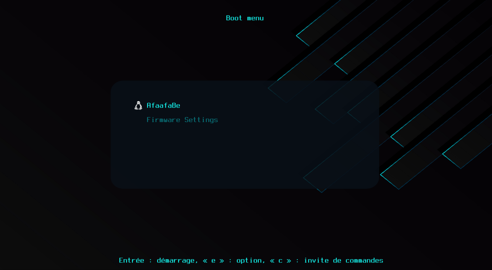

# GRUB Theme - AfaafaBe

## Preview



---

## Installation Manual

To install the **AfaafaBe** custom GRUB theme, just follow these steps:


Copy the entire theme folder to `/boot/grub/themes/*`

Update GRUB to apply the changes:

 ```bash
   sudo update-grub

